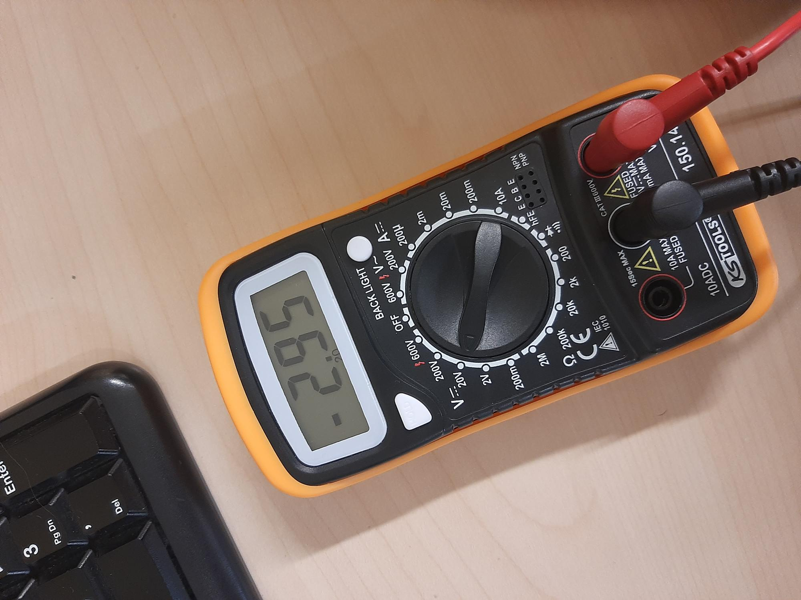

# vaja9---DAC-pretvorba

Slika pinout konfiguracije

Slika voltmetra

Odgovori na vprašanja:

b) ) V kategoriji Analog kliknite na oznako DAC. Koliko DAC izhodov ima ta razvojna ploščica?

2

c)  Kakšno je napetostno območje na DAC izhodu? Od _____ do _____ V (pomagajte si s PDF dokumentacijo 
razvojne ploščice)

od 0 do 3 V

d) Obkljukajte prosti DAC. Kateri pin se je obarval za DAC pretvorbo oz. izhod?

Pin PA5

e)  Pod Configuration DAC-a v Parameter Settings zapišite osnovni dve nastavitvi, ki so privzete za takšno 
pretvorbo:

Output buffer: Enable
Trigger: None

e2)  S pomočjo V-metra preverite napetost na vašem DAC izhodnem pinu (fotografirajte izmerjeno vrednost).
Kakšno je odstopanje v mV?

/

Komentar:
Naloga ni delovala, nisva morala zmeriti med PA5 in GND, saj je vedno kazalo 0. Na sliki od V-metra je prikazana edina napetost ki se je pokazala na V metru, čeprav sva probala iti skozi vse pine.
